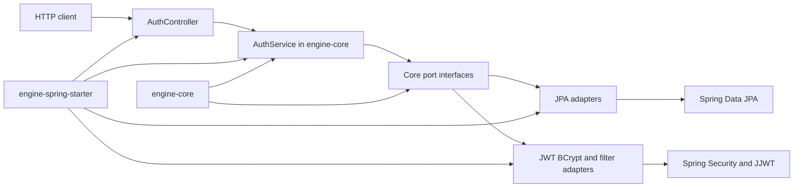

# Core–Starter System Boundaries

The reactor has two Maven modules: `engine-core` and `engine-spring-starter`. The root POM packages them together, while the starter has the sole declared module dependency on `engine-core`; the core POM has no dependencies. This establishes the dependency rule: domain policy depends on its own abstractions, and Spring/JPA/JWT/Servlet code lives outward in the starter—not the reverse.

## Boundary at a glance

`engine-core` owns the authentication model, exceptions, port contracts, and the `AuthService` application use case. It imports only core Java and its own packages. `AuthService` receives all environmental capabilities through its constructor:

- `UserRepositoryPort` and `RefreshTokenRepositoryPort` for user and refresh-token state;
- `PasswordEncoderPort` and `TokenServicePort` for credential and token operations;
- `TokenBlacklistPort` and `AuditLogPort` for logout side effects.

Consequently, core neither knows nor chooses Spring beans, HTTP routes, database tables, JPA repositories, BCrypt, or JWT libraries. An adapter may be replaced—or a direct core client may supply test doubles—without changing the use case.

*Module and runtime dependencies point inward to the core ports; only the starter reaches Spring infrastructure.*

## Core behavior and invariants

The core service is the policy boundary, not a persistence or transport boundary:

- **Registration** rejects an existing email, encodes the supplied password, creates a `USER` with a generated ID, saves it, and returns newly generated tokens.
- **Login** requires a stored user and a matching password before token generation.
- **Refresh** requires a stored, non-expired, non-revoked refresh token, finds the user from `TokenServicePort.extractUserEmail(refreshToken)`, revokes the old stored token, then issues and stores a replacement pair. This is refresh-token rotation.
- **Logout** blacklists the supplied access token for a fixed 15-minute-from-now expiry and writes a `LOGOUT_SUCCESS` audit record. The policy does not validate that the supplied email matches the token.

`generateTokens` always persists a `RefreshToken` with a seven-day expiry, regardless of adapter configuration. Token implementations must therefore make their refresh-token representation compatible with `extractUserEmail`: `AuthService.refresh` calls that method on the refresh token. This is a crucial port contract beyond the Java signature.

Failures currently propagate as exceptions: duplicate registration uses `UserAlreadyExistsException`; absent users, bad credentials, and invalid or unusable refresh tokens use `RuntimeException`. The core deliberately does not map them to HTTP responses.

## What the starter supplies

The starter is Spring Boot’s composition and adapter layer. Its `META-INF/spring/org.springframework.boot.autoconfigure.AutoConfiguration.imports` entrypoint loads four configurations: `EngineAutoConfiguration`, `AuthControllerConfiguration`, `EngineSecurityBeansConfiguration`, and `EngineWebSecurityAutoConfiguration`.

### Base composition and overrides

`EngineAutoConfiguration` binds `com.engine.starter.EngineSecurityProperties`, registers the starter persistence package, enables Spring Data repositories for `com.engine.starter.persistence`, and conditionally supplies in-memory implementations for the user repository, refresh repository, token blacklist, audit logger, and password encoder. It then creates `AuthService` only if no `AuthService` bean exists.

Every default is guarded by bare `@ConditionalOnMissingBean`, so a consuming application can provide a bean for a port and replace the default. However, `EngineAutoConfiguration` supplies **no** `TokenServicePort`. An `AuthService` can only be constructed when another configuration or the application supplies that port. In the web path, `EngineSecurityBeansConfiguration` supplies `JwtServiceAdapter` conditionally. A non-web consumer must supply `TokenServicePort` itself (and any desired port implementations) or cannot satisfy the `AuthService` factory method.

The in-memory defaults are process-local. In particular, `InMemoryUserRepository` uses an unsynchronized `HashMap`; they are fallback wiring, not durable or multi-instance infrastructure.

### Web entrypoints

`AuthControllerConfiguration` conditionally exposes `AuthController`, which maps:

- `POST /auth/register` to `AuthService.register`;
- `POST /auth/refresh` to `AuthService.refresh`;
- `GET /auth/health` to a fixed health string.

The controller returns the core `AuthResponse` directly and has no logout endpoint. `GlobalExceptionHandler` exists as a `@RestControllerAdvice`, but is not an auto-configuration import; it only participates if a consumer scans or imports it. When it does, it converts all `RuntimeException` instances to HTTP 400 strings, including authentication failures.

### Persistence discovery and adapters

`EngineJpaPackageRegistrar` registers `com.engine.starter.persistence` in Spring Boot’s auto-configuration packages, and `EngineAutoConfiguration` also uses `@EnableJpaRepositories` for that package. This is what makes the starter’s entities and repositories available even though a consumer’s component scan normally begins at its own application package.

The JPA adapters translate at the port boundary:

- `UserRepositoryAdapter` maps `User` to/from `UserEntity` and delegates email lookup and save to `JpaUserRepository`.
- `RefreshTokenRepositoryAdapter` maps `RefreshToken` to/from `RefreshTokenEntity`; `revoke` sets the entity’s revoked flag only if the row exists.
- `TokenBlacklistAdapter` is still an in-memory `ConcurrentHashMap`, removing expired entries only when the corresponding token is checked.
- `AuditLogAdapter` currently prints audit records rather than persisting them.

Thus “JPA-enabled starter” means users and refresh tokens are JPA-backed only when those adapters win bean selection; blacklist and audit state are not database-backed by this code.

### Security integration

For a web application, `EngineSecurityBeansConfiguration` is ordered after `EngineAutoConfiguration`. It conditionally creates JPA user and refresh adapters, in-memory blacklist and audit adapters, a BCrypt password adapter, `JwtServiceAdapter` as `TokenServicePort`, `UserDetailsServiceAdapter`, and `JwtAuthenticationFilter`. The filter runs once per request before `UsernamePasswordAuthenticationFilter`: it ignores requests without a Bearer header or with a blacklisted token; otherwise it extracts the email, validates the token, loads user details from JPA, and installs an authentication in the `SecurityContext`.

`EngineWebSecurityAutoConfiguration` imports `SecurityConfig` for web applications with Spring Security present. Its highest-precedence chain disables form login, HTTP Basic, logout, and CSRF; is stateless; permits configured public paths; requires `ADMIN` for `/admin/**`; requires authentication elsewhere; and inserts the JWT filter. `engine.security.public-paths` can override the default public path list.

`JwtServiceAdapter` signs and validates access tokens using `engine.security.jwt-secret` and uses `engine.security.access-expiration` for their expiry. It generates refresh tokens as random UUIDs, yet `AuthService.refresh` asks `extractUserEmail` to parse the refresh token as a signed JWT. With this supplied adapter, refresh therefore cannot recover the email from its generated refresh token and will fail. Configure or implement a `TokenServicePort` whose refresh tokens satisfy the core refresh contract before relying on refresh in production. `jwtSecret` must also be non-null and a key acceptable to `Keys.hmacShaKeyFor`, or token signing/parsing fails.

## Safe-change warnings: overlapping configuration

The source contains overlapping configurations; do not treat every class under `config` or `security` as an independently active starter feature.

1. `AuthServiceConfig` duplicates the `AuthService` factory in `EngineAutoConfiguration`, but it is **not** in `AutoConfiguration.imports`. It may become active if an application scans or explicitly imports it. Both factories are missing-bean conditional, but accidental scanning changes which configuration creates the service and makes ordering relevant.
2. `EngineSecurityBeansConfiguration` intentionally declares `@AutoConfiguration(after = EngineAutoConfiguration.class)`. Its port-level `@ConditionalOnMissingBean` checks run after the base in-memory defaults. As written, those defaults win, so the JPA user/refresh adapters and BCrypt adapter are not selected in the normal imported configuration unless the application supplies beans or the base defaults are changed. The ordering avoids duplicate port beans, but it also prevents the later persistence/security adapters from replacing earlier defaults.
3. There are two distinct `EngineSecurityProperties` classes, `com.engine.starter.EngineSecurityProperties` and `com.engine.starter.config.EngineSecurityProperties`, both bound to `engine.security`. `EngineAutoConfiguration` enables the former, while `SecurityConfig` and `JwtServiceAdapter` use the latter (and `SecurityConfig` enables it). The same external properties bind separately by type. Consolidate them before extending properties to avoid divergent defaults or injection confusion.
4. `EngineSecurityFilterAutoConfiguration` defines two more high-precedence filter chains but is not listed in `AutoConfiguration.imports`. If it is component-scanned or manually imported alongside `SecurityConfig`, its public-path chain and broad `/**`.permitAll() chain overlap the imported authenticated chain. Its comment claims it backs off for an existing `SecurityFilterChain`, but its bean methods have no `@ConditionalOnMissingBean`; do not enable it together with `EngineWebSecurityAutoConfiguration` without an explicit chain design.

These overlaps are especially important because `SecurityConfig.securityFilterChain` itself is unconditional and ordered `HIGHEST_PRECEDENCE`. A consumer that owns security should explicitly provide and test its filter-chain arrangement rather than assuming ordinary conditional-bean replacement applies.

## Operating and extending the boundary

For the normal web starter route, provide a datasource/JPA setup plus `engine.security.jwt-secret` and nonzero expiration values. Ensure the secret meets the JJWT HMAC key requirements. Override a port by declaring an application bean of that port type; because the default beans are conditional, the application bean is the supported substitution seam. If JPA is desired, do not assume merely adding the datasource switches repository ports—the base defaults and ordering described above determine the selected implementations.

Use `mvn test` from the repository root to build the reactor; there are no Java test sources in this repository at present. High-value tests to add before changing this boundary are:

- a core-only unit test with fake ports for duplicate registration, credential failure, refresh expiry/revocation, rotation, and logout side effects;
- an application-context test proving which port beans win under default, application-provided, and JPA-enabled configurations;
- a Spring MVC/security integration test for public `/auth/**`, authenticated non-public routes, `/admin/**` role checks, blacklist behavior, and exactly one intended filter-chain arrangement;
- a refresh round-trip test with the selected `TokenServicePort`, which would expose the UUID-versus-email-extraction incompatibility in `JwtServiceAdapter`.

See also [Auth Domain and Ports](/openwiki/concepts/auth-domain-and-ports.md), [Spring Boot Starter](/openwiki/integrations/spring-boot-starter.md), and [Configuration and Persistence](/openwiki/operations/configuration-and-persistence.md).
