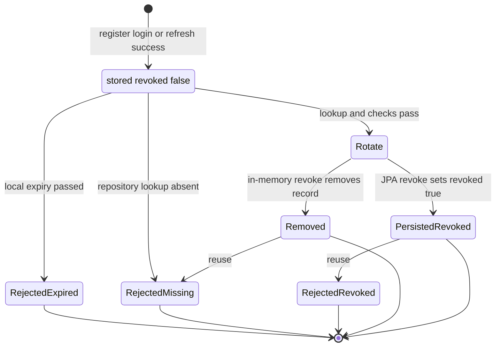

# Authentication Domain and Port Contracts

`engine-core` owns framework-independent authentication orchestration. `AuthService` has no Spring types and receives storage, password, token, blacklist, and audit capabilities through ports. The starter supplies implementations, but an adapter is safe only when it preserves the core service's expectations—not merely when it implements an interface.

## Domain vocabulary and ownership

| Type | Core responsibility |
| --- | --- |
| `User` | Immutable authentication principal: generated string `id`, `email`, stored `passwordHash`, and `Role`. The core creates registrations with `Role.USER`; `Role.ADMIN` is available but is not assigned by a core operation. |
| `RefreshToken` | Immutable server-side record keyed by the opaque token string, associating it with `userId`, an `Instant` expiry, and a `revoked` flag. `isExpired()` is true only when the current instant is strictly after expiry. |
| `BlacklistedToken` | Value type for an access token and epoch-millisecond expiry. `AuthService` passes equivalent values to the blacklist port on logout; it does not instantiate this type. |
| `AuditLog` | Immutable event payload of user email, action, and epoch-millisecond timestamp. The only event currently emitted by the core is `LOGOUT_SUCCESS`. |
| `AuthResponse` | Immutable return payload containing the newly minted access and refresh token strings. |

The JPA mapping reflects `User` into the `users` table and `RefreshToken` into `refresh_tokens`, with the refresh token itself as the primary key. `BlacklistedTokenEntity` exists for `blacklisted_tokens`, but the supplied blacklist adapter is an in-process map rather than a JPA adapter.

## Ports: behavioral contracts

| Port | Required semantics for a compatible adapter | Core use |
| --- | --- | --- |
| `UserRepositoryPort` | Look up by the exact supplied email and persist a user. The service performs a pre-save lookup to reject an already visible email, but the interface has no atomic create or uniqueness result; persistent adapters should enforce email uniqueness to close concurrent registration races. | Registration checks `findByEmail`, then saves; login and refresh resolve a user by email. |
| `PasswordEncoderPort` | `encode(raw)` must produce the value stored as `User.passwordHash`; `matches(raw, stored)` must verify against that value. Do not use reversible/plaintext substitution. | Registration encodes before persistence; login denies when `matches` is false. Supplied implementations use BCrypt. |
| `TokenServicePort` | Mint access and refresh strings, validate an access token, and extract the user email from the token passed to it. Refresh is especially constrained: `AuthService.refresh` calls `extractUserEmail` on the stored refresh token, so a usable refresh format must support that operation. | Token issuance calls both generators; refresh extracts email; the HTTP filter extracts and validates bearer access tokens. |
| `RefreshTokenRepositoryPort` | Save and retrieve the exact token record; `revoke(token)` must make that token unusable on later lookup. It may remove the record or persist `revoked=true`; callers must not assume one representation. | Generated refresh records are saved; refresh reads, rejects expired/revoked records, then revokes the old token before issuing a replacement. |
| `TokenBlacklistPort` | Record an access token until the supplied epoch-millisecond expiry, and report whether it is currently blacklisted. Expiry-aware implementations should discard/ignore an elapsed entry. | Logout blacklists the supplied access token; the JWT filter declines to authenticate a blacklisted bearer token. |
| `AuditLogPort` | Accept the logout audit event. It is a side effect after blacklisting, so an exception from it propagates after the blacklist write. | Logout saves `AuditLog(email, "LOGOUT_SUCCESS", now)`. |

## Service entrypoints and failure behavior

### Registration

`register(email, password)` first calls `findByEmail(email)`. A present value raises `UserAlreadyExistsException` with `User already exists`; the user is neither encoded nor saved. Otherwise it generates a UUID string id, hashes the password through `PasswordEncoderPort`, creates a `USER`, saves it, and immediately generates and persists a refresh record before returning both tokens.

This is an application-level duplicate check, not a database guarantee: neither `UserRepositoryPort` nor `UserEntity` declares uniqueness for email. A persistence implementation should provide a uniqueness constraint and translate a collision consistently, especially under concurrent requests. There is also no core input validation for null, email format, or password policy.

### Login

`login(email, password)` loads by email or throws `RuntimeException("User not found")`. It then calls `passwordEncoder.matches(password, user.getPasswordHash())`; a false result throws `RuntimeException("Invalid credentials")`. A successful login generates a fresh access/refresh pair and saves a new refresh record, without revoking any earlier refresh records.

### Refresh and rotation

`refresh(refreshToken)` has a deliberately ordered gate:

1. Retrieve the record by the exact supplied string, otherwise throw `RuntimeException("Invalid refresh token")`.
2. Reject a record whose local expiry has passed or whose persisted/domain `revoked` flag is true with `RuntimeException("Refresh token expired or revoked")`.
3. Extract an email from that same string through `TokenServicePort`, then find the user or throw `RuntimeException("User not found")`.
4. Call `refreshRepo.revoke` for the old string, then generate and save a replacement pair.

Token extraction exceptions are not caught, and the service does not compare the loaded record's `userId` with the extracted user's id. Thus adapters must ensure the token format and repository association cannot be mixed to preserve identity binding. The ordering also means a missing user or extraction failure leaves the stored refresh record unrevolved; only after both succeed is rotation attempted.

This state diagram shows the observable refresh-token lifecycle: the `revoke` port supports both deletion and persisted revocation, which lead to different subsequent failure messages.

### Logout

`logout(accessToken, email)` does not inspect the access token, revoke refresh tokens, or authenticate the email. It computes `System.currentTimeMillis() + 900000`, blacklists the supplied access string, then writes the logout audit record. Therefore the core blacklist retention is **hard-coded to 900,000 ms (15 minutes)** regardless of configured JWT expiry. The in-memory default blacklist retains strings indefinitely and ignores the supplied expiry; `TokenBlacklistAdapter` retains the expiry and lazily removes an entry when checked after it has elapsed.

## Lifetimes and token implementation compatibility

The refresh record created by the core always expires at `Instant.now().plus(7, ChronoUnit.DAYS)`. This server-side **seven-day lifetime is hard-coded** and is independent of starter properties. Access token lifetime is delegated to `TokenServicePort`; the supplied JWT implementations read `engine.security.access-expiration`, and `DefaultJwtTokenService` also reads `engine.security.refresh-expiration` when generating JWT refresh tokens.

There is a consequential adapter mismatch to resolve before relying on the out-of-box web wiring: `JwtServiceAdapter.generateRefreshToken` returns a random UUID, but `AuthService.refresh` requires `extractUserEmail(refreshToken)`, and that adapter parses its input as a signed JWT. Its generated refresh token therefore fails extraction before rotation. A compatible `TokenServicePort` must either issue an email-bearing, extractable refresh token (as `DefaultJwtTokenService` does) or the core contract must be redesigned to resolve identity from the stored token's `userId`.

## Adapter and operational guidance

* The default in-memory user and refresh repositories are process-local. Refresh revocation is deletion in `InMemoryRefreshTokenRepository`, while `RefreshTokenRepositoryAdapter` updates the JPA entity to `revoked=true`; the latter enables the explicit revoked rejection path.
* `EngineAutoConfiguration` supplies in-memory user, refresh, blacklist, audit, and password ports when missing. A web-only configuration also offers JPA/security adapters after that configuration, so the earlier defaults normally satisfy the missing-bean conditions. Supply the intended port beans explicitly when persistence matters.
* The `JwtAuthenticationFilter` checks the blacklist before extracting and validating a bearer token. It deliberately continues the chain without establishing authentication for a blacklisted token; authorization later determines the response.
* `GlobalExceptionHandler` maps every `RuntimeException`—including the duplicate-user exception and the service's stringly failures—to HTTP 400 when that advice is registered. Token parser errors also extend runtime exceptions and follow that broad mapping.
* The included `AuthController` exposes registration and refresh (plus health), not core `login` or `logout`; integrations that need those operations must invoke `AuthService` themselves or provide endpoints.

## Focused verification for an adapter change

Test the contract at the `AuthService` boundary with fakes, then repeat the persistence-sensitive cases against the selected adapter:

1. Duplicate email: a pre-existing lookup throws `UserAlreadyExistsException`, does not call encoder/save, and uses no token generation.
2. Login: assert stored hash is passed to `matches`; missing user and mismatch produce their distinct messages, while success saves a refresh record.
3. Refresh: cover missing record, expired record, persisted revoked record, extraction failure, missing extracted user, and successful rotation. For success, verify revocation happens before replacement save and reuse has the adapter-specific missing vs revoked result.
4. Token compatibility: round-trip a generated refresh token through `extractUserEmail`; this catches the UUID/JWT mismatch. Also test disagreement between configured JWT refresh expiry and the core seven-day record expiry.
5. Logout/filter: assert the expiry argument is exactly roughly `now + 900000`, audit follows blacklist, and a blacklisted bearer cannot populate the security context. Test expiry cleanup if using `TokenBlacklistAdapter` rather than the non-expiring in-memory default.

For integration configuration and persistence wiring, see [Configuration and persistence](/openwiki/operations/configuration-and-persistence.md). For endpoint/security-chain behavior and known gaps, see [Spring Boot starter](/openwiki/integrations/spring-boot-starter.md) and [Validation and known gaps](/openwiki/testing/validation-and-known-gaps.md).
