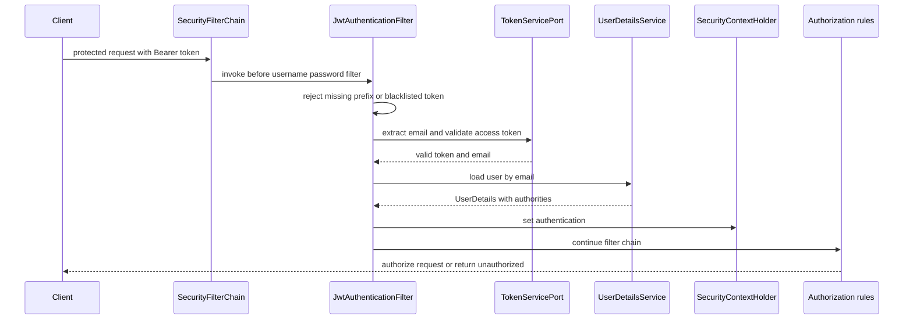

## Scope and activation

`engine-spring-starter` is the Spring-facing module over the framework-independent `engine-core` authentication service. Its auto-configuration is discovered through `META-INF/spring/org.springframework.boot.autoconfigure.AutoConfiguration.imports`; the artifact brings Spring Web, Spring Security, Spring Data JPA, H2, and JJWT dependencies. The imports are the authoritative activation surface—not every `@Configuration` or controller class packaged in the JAR.

The imports are:

| Imported auto-configuration | Activation and effect |
| --- | --- |
| `EngineAutoConfiguration` | Requires `AuthService` on the classpath. Enables root `EngineSecurityProperties`, registers the starter persistence package and repositories, and supplies in-memory port defaults plus `AuthService`. |
| `AuthControllerConfiguration` | Registers `AuthController` unless a bean of that controller class already exists. |
| `EngineSecurityBeansConfiguration` | Runs after `EngineAutoConfiguration` in a web application. It creates the JWT, user-details, filter, and persistence-adapter beans only when matching port/type beans are missing. |
| `EngineWebSecurityAutoConfiguration` | In a web application with `SecurityFilterChain` available, imports `SecurityConfig`, which installs the effective security chain. |

The JPA package registrar adds `com.engine.starter.persistence` to Spring Boot's auto-configuration packages and `EngineAutoConfiguration` explicitly enables repositories in that package. Consequently, the starter asks the application context to discover its managed persistence types even when the consuming application's component scan does not include the starter package.

## Default wiring and replacement boundary

The integration boundary is the core ports. `EngineAutoConfiguration` uses `@ConditionalOnMissingBean` to provide `InMemoryUserRepository`, `InMemoryRefreshTokenRepository`, `InMemoryTokenBlacklist`, `SimpleAuditLogger`, `DefaultPasswordEncoder`, and an `AuthService` assembled from all six required ports, including a `TokenServicePort`. An application can replace any of these port beans (or `AuthService`) before auto-configuration backs off.

`EngineSecurityBeansConfiguration` is ordered after those defaults. Its JPA user/refresh adapters, blacklist and audit adapters, and BCrypt password adapter are therefore normally suppressed by the earlier in-memory port beans; they are alternatives only when the corresponding port was not already provided. In contrast, `EngineAutoConfiguration` does **not** provide `TokenServicePort`, so the later `JwtServiceAdapter` normally becomes the token service. It also supplies a `UserDetailsServiceAdapter` backed directly by `JpaUserRepository` and a `JwtAuthenticationFilter`, unless the application supplies beans of those types.

This ordering has an important operational consequence: the usual default `AuthService` writes registered users to the in-memory user port, while protected-request authentication loads users from `JpaUserRepository`. A user created through the default registration flow is therefore not automatically visible to `UserDetailsServiceAdapter`; aligning the user repository/`UserDetailsService` implementations is required for a working protected-request path. The default in-memory state is process-local; its blacklist also ignores the expiry passed to `blacklist`, so revoked tokens remain blacklisted until process restart.

## Configuration

Both `com.engine.starter.EngineSecurityProperties` and `com.engine.starter.config.EngineSecurityProperties` bind the same `engine.security` prefix. The root type is enabled by `EngineAutoConfiguration`; the `config` type is enabled by `SecurityConfig` and is consumed by `JwtServiceAdapter` and the effective filter chain. Configure the shared properties explicitly:

```yaml
engine:
  security:
    jwt-secret: a-secret-with-sufficient-HMAC-key-material
    access-expiration: 900000
    refresh-expiration: 604800000
    public-paths:
      - /auth/**
```

`jwt-secret` is dereferenced to build an HMAC key; it must be set and acceptable to JJWT's `Keys.hmacShaKeyFor`. Access-token expiry is applied from `access-expiration`. Although the property exposes `refresh-expiration`, the normally selected `JwtServiceAdapter` generates refresh tokens as UUIDs, while the core service independently records each refresh token with a fixed seven-day expiry. Do not assume the refresh-expiration property controls that default refresh-token lifecycle.

`public-paths` replaces—not augments—the list used by `SecurityConfig`. If absent or empty, the defaults are `/`, `/home`, `/auth/**`, `/error`, `/actuator/**`, `/swagger-ui/**`, `/swagger-ui.html`, and `/v3/api-docs/**`. Replacing the list can inadvertently make the auth routes require authentication.

## HTTP surface: registered endpoints

Because `AuthControllerConfiguration` is imported, these are the controller methods actually registered by the starter (subject to the application context starting):

| Method and path | Request body | Result |
| --- | --- | --- |
| `POST /auth/register` | `RegisterRequest`: `email`, `password` | Calls `AuthService.register`; returns `AuthResponse` with `accessToken` and `refreshToken`. New users receive role `USER`. |
| `POST /auth/refresh` | `RefreshRequest`: `refreshToken` | Calls `AuthService.refresh`; revokes the stored old token and returns a newly generated pair when the token is stored, unexpired, and not revoked. |
| `GET /auth/health` | none | Returns `auth service up`. |

All `/auth/**` paths are public under the default chain. The request DTOs contain no validation annotations, so this module itself does not impose bean-validation constraints on email or password payloads.

### Advertised-versus-implemented gap

The repository README advertises `POST /auth/login` and `POST /auth/logout`, and `AuthService` has `login` and `logout` methods. `AuthController`, however, maps neither method. They are **not starter endpoints** and must not be presented to clients as available. In particular, there is no HTTP path that calls `logout` to blacklist the bearer token. The controller also has no method-level exception mapping; a `GlobalExceptionHandler` class exists in the artifact but is not in the auto-configuration imports, so it is not part of the starter's guaranteed integration surface.

## Registered security behavior

`EngineWebSecurityAutoConfiguration` imports `SecurityConfig`. Its highest-precedence `SecurityFilterChain` disables form login, HTTP Basic, logout, and CSRF; makes sessions stateless; uses `JsonUnauthorizedEntryPoint`; permits configured public paths; requires `ROLE_ADMIN` for `/admin/**`; and requires authentication for every other request. It inserts `JwtAuthenticationFilter` before `UsernamePasswordAuthenticationFilter`.

For each request, the filter does nothing when `Authorization` is missing or not `Bearer ` prefixed, or when the complete bearer token is blacklisted. Otherwise it extracts the email, validates the access JWT, loads `UserDetails` by email, and stores an authentication token with that user's authorities in `SecurityContextHolder`. `UserDetailsServiceAdapter` translates the database `UserEntity` email, password, and role into Spring `UserDetails`; Spring's `roles` builder supplies the `ROLE_` prefix used by the `/admin/**` rule. The JWT role claim is not used for authorization—the current loaded user's role is.



*Protected request flow through the registered JWT filter, token service, database-backed user loading, and authorization chain.*

Failure behavior is not uniformly converted to 401. A missing, malformed-prefix, blacklisted, or validation-failing token leaves the context unauthenticated, after which protected routes use the JSON authentication entry point. But `extractUserEmail` parses the token before `validateAccessToken` and is not caught by the filter; malformed, expired, or wrongly signed bearer token parsing can escape as a filter exception. Similarly, a valid token whose email cannot be loaded causes `UsernameNotFoundException`. Test these cases alongside successful user loading and `/admin/**` authorization when changing the integration.

## Classes present but not imported

`EngineSecurityFilterAutoConfiguration` is packaged in the artifact but absent from `AutoConfiguration.imports`. It must not be confused with the active `SecurityConfig` chain. If separately imported or component-scanned by an application, it defines a public-path chain and a second chain that permits `/**`; it does not add the JWT filter. That alternate configuration can materially weaken protection and is not part of the standard starter activation.

Likewise, `SecurityConfig` is effective specifically because `EngineWebSecurityAutoConfiguration` imports it; its presence as an `@Configuration` class alone is not evidence that a normal consumer scan registers it. Consumers should override deliberately—by providing their own port beans, `UserDetailsService`, `JwtAuthenticationFilter`, controller, or security chain—and integration-test both auto-configuration ordering and route authorization after doing so.

## Focused verification

There are no starter tests in this repository. A consuming application should at minimum verify: auto-configuration loads with a valid HMAC secret and JPA setup; only the three documented controller mappings exist; a registered user can be loaded by the configured `UserDetailsService`; public-path replacement has the intended effect; a valid bearer token authorizes a protected route; blacklisted, malformed, expired, absent, and unknown-user tokens take the expected failure path; and a non-admin versus `ROLE_ADMIN` principal receives the intended result for `/admin/**`.
