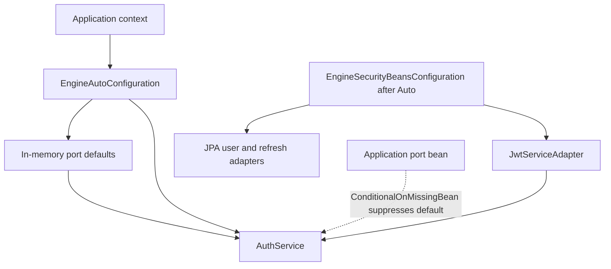

## Scope and operating model

The starter supplies `AuthService` and its ports through Spring Boot auto-configuration. Its principal state is users, refresh-token records, and an access-token blacklist. The source contains both in-memory implementations and JPA adapters, but the auto-configuration ordering means the in-memory implementations are the effective defaults; merely including the starter does **not** switch these ports to JPA.



This shows the configured beans and the ordering that makes the in-memory port beans win unless the application supplies a port bean.

## `engine.security` binding: two types, one prefix

There are two distinct classes named `EngineSecurityProperties`, both annotated with `@ConfigurationProperties(prefix = "engine.security")`:

| Type | Explicitly enabled by | Current consumer |
| --- | --- | --- |
| `com.engine.starter.EngineSecurityProperties` | `EngineAutoConfiguration` and `EngineSecurityFilterAutoConfiguration` | `DefaultJwtTokenService` (although that class is not declared as a bean by the inspected auto-configuration); the filter auto-configuration also consumes its path list. |
| `com.engine.starter.config.EngineSecurityProperties` | `SecurityConfig` | `JwtServiceAdapter` and `SecurityConfig`. |

They bind the same four logical fields independently: `jwtSecret`, `accessExpiration`, `refreshExpiration`, and `publicPaths`. Neither property class initializes the secret or either duration: absent numeric values bind as Java `long` zero, while an absent secret remains `null`. The binding itself does not validate a secret or durations. Since signing calls `props.getJwtSecret().getBytes()`, a missing secret fails when the token service tries to create or verify a key; short or otherwise invalid HMAC key material is also delegated to JJWT rather than checked during configuration.

A deployment configuration must therefore provide the values used by the active `JwtServiceAdapter`, for example:

```yaml
engine:
  security:
    jwt-secret: ${ENGINE_JWT_SECRET}
    access-expiration: 900000
    refresh-expiration: 604800000
```

The durations are passed to `System.currentTimeMillis()` as milliseconds. `JwtServiceAdapter` uses `accessExpiration` for access-token expiry, but generates refresh values as random UUIDs and does not consult `refreshExpiration`. Separately, `AuthService` stores every generated refresh token with a fixed seven-day expiry. Do not assume that changing `refresh-expiration` changes the active refresh-token lifetime.

### JWT format and validation

The active adapter signs access JWTs with an HMAC SHA-256 key derived directly from `jwtSecret` bytes. It sets the subject to the user's email, adds a `role` claim, and sets issued-at and expiry timestamps. Validation and email extraction parse a signed JWS with the same key. `validateAccessToken` returns `false` for parser errors, but `extractUserEmail` does not catch parsing errors; the authentication filter calls extraction before validation for a bearer token, so malformed, expired, or wrongly signed bearer input can propagate an exception rather than being converted by that filter to an anonymous request.

`DefaultJwtTokenService` has a different implementation: it generates both access and refresh values as JWTs and uses the two configured expirations. It is not exposed by `EngineAutoConfiguration` as a `TokenServicePort` bean in the inspected code. Conversely, the active `JwtServiceAdapter` produces UUID refresh tokens, while `AuthService.refresh` calls `TokenServicePort.extractUserEmail(refreshToken)`, which expects a signed JWT. With the shipped active adapter, a refresh record can be found and pass its stored expiry/revocation checks but email extraction cannot parse the UUID. This is a current compatibility defect, not a usable rotation guarantee.

## Route policy and security-chain ownership

`SecurityConfig`, imported through `EngineWebSecurityAutoConfiguration`, installs a stateless `SecurityFilterChain`. It disables form login, HTTP Basic, logout, and CSRF; it uses `JsonUnauthorizedEntryPoint`; inserts `JwtAuthenticationFilter` before `UsernamePasswordAuthenticationFilter`; permits configured public paths; requires `ROLE_ADMIN` for `/admin/**`; and requires authentication for all other requests.

The default public list is:

```text
/
/home
/auth/**
/error
/actuator/**
/swagger-ui/**
/swagger-ui.html
/v3/api-docs/**
```

Set `engine.security.public-paths` to replace that list. An empty or null list is treated by both security configurations as a request to restore their hard-coded default list, not as “no public paths.” Public paths include actuator and API documentation by default, so production applications should explicitly choose their exposure policy rather than inheriting this list.

The auto-configuration import file imports `EngineWebSecurityAutoConfiguration`, which imports `SecurityConfig`; it does **not** list `EngineSecurityFilterAutoConfiguration`. The latter is an additional, independently annotated auto-configuration class in the source but is not an entry in that import file. If an application supplies its own security configuration, it must review Spring Security filter-chain ordering and ensure the JWT filter and authorization policy it intends are actually installed; there is no `@ConditionalOnMissingBean(SecurityFilterChain.class)` on `SecurityConfig`.

## State implementations and their semantics

### Effective in-memory defaults

`EngineAutoConfiguration` supplies `InMemoryUserRepository`, `InMemoryRefreshTokenRepository`, `InMemoryTokenBlacklist`, `SimpleAuditLogger`, and a BCrypt password encoder only when missing beans permit it. User and refresh repositories use plain `HashMap`; the blacklist uses a plain `HashSet`. These stores are process-local, vanish on restart, are not shared between replicas, and have no synchronization. They are suitable for local development only, not a durable or concurrent deployment.

Refresh-token revocation differs materially between the implementations:

* `InMemoryRefreshTokenRepository.revoke` removes the record. A later lookup reports it as absent.
* `RefreshTokenRepositoryAdapter.revoke` retains the database row and changes its `revoked` flag to `true`. `AuthService.refresh` rejects a retrieved token that is revoked or whose stored `Instant` expiry has passed.

The in-memory blacklist ignores the supplied expiry and retains every blacklisted token until the process stops. `TokenBlacklistAdapter` instead stores token-to-expiry entries in a `ConcurrentHashMap` and removes an entry only when `isBlacklisted` is called after that expiry. That is lazy cleanup, not scheduled cleanup, it is still memory-only, and entries that are never queried remain retained. Although `BlacklistedTokenEntity` exists, the supplied blacklist adapter does not use it; access-token revocation is not database-backed.

### JPA-backed users and refresh records

The registrar calls `AutoConfigurationPackages.register` for `com.engine.starter.persistence`, and `EngineAutoConfiguration` additionally enables JPA repositories in that package. Thus the starter exposes `UserEntity` (`users`) and `RefreshTokenEntity` (`refresh_tokens`) plus their Spring Data repositories without requiring the consuming application to add that package to its component scan. The user adapter maps ID, email, password hash, and role; the refresh adapter maps token string, user ID, expiry, and revoked state.

However, `EngineSecurityBeansConfiguration` runs after `EngineAutoConfiguration` and makes its JPA port adapters conditional on the corresponding port being absent. The earlier in-memory port beans already satisfy those conditions, so the JPA `UserRepositoryAdapter` and `RefreshTokenRepositoryAdapter` do not replace the defaults under the normal starter configuration. Registration of entities/repositories does not equal selection of their adapters.

## Supported override boundary

Provide an application bean implementing the relevant core port—`UserRepositoryPort`, `RefreshTokenRepositoryPort`, `TokenBlacklistPort`, `AuditLogPort`, `PasswordEncoderPort`, or `TokenServicePort`—to suppress the starter's conditional default for that port. Override a coherent set of collaborating ports rather than assuming that JPA discovery changes state ownership. In particular, a production refresh implementation must preserve the `save`, lookup, expiry, and revoke contract expected by `AuthService`, and an access-token revocation implementation must be durable and shared by all serving instances.

The JPA adapters are candidates for user and refresh persistence only after the application arranges for them to be selected (for example, by supplying port beans). Do not select the stock `TokenBlacklistAdapter` as a production persistence solution: it is concurrent within one JVM and lazily cleans on lookup, but is neither durable nor distributed. Audit logging is also not persistent: both shipped audit implementations print to standard output.

## Production readiness gaps and operational checklist

The following are requirements imposed by the current implementation's limitations, not features it already provides:

1. **Durability and multi-instance consistency:** replace process-local users, refresh records, blacklist, and stdout-only audit logging with durable shared implementations. Add database uniqueness constraints/transactional handling as appropriate; the in-memory `find`-then-`save` registration path and map adapters provide no concurrency guarantees.
2. **Refresh lifecycle:** resolve the UUID-versus-JWT mismatch before enabling refresh. Define rotation atomicity and replay handling in the persistence adapter, then clean expired/revoked refresh records; no cleanup job is supplied.
3. **Blacklist lifecycle:** use a shared revocation store with expiry/TTL or scheduled cleanup. The supplied in-memory default grows without expiry cleanup; the alternate adapter only deletes expired entries on lookup.
4. **Secrets and token policy:** inject a sufficiently strong secret from a secret manager or environment, never source control; validate its presence and strength during deployment; plan rotation because validation uses one current symmetric key. Set access lifetime intentionally, because logout uses a hard-coded 15-minute blacklist expiry rather than the configured access duration.
5. **HTTP exposure and authorization:** use HTTPS, explicitly review `public-paths` (including actuator and documentation), and integration-test unauthorized, public, and admin requests against the application's actual `SecurityFilterChain`.
6. **Observability:** replace `System.out.println` diagnostics/audit output with structured logs, metrics, alerts, and safe audit retention. No production monitoring, rate limiting, health policy beyond the controller's simple `/auth/health`, or cleanup scheduler is implemented here.
7. **Verification:** this repository contains no `*Test.java` or `*IT.java` tests. Add focused tests for property binding failures, chosen adapter beans, JPA mappings and revocation semantics, blacklist expiry, refresh rotation, JWT rejection, and filter-chain authorization before relying on the starter in production.

See [Auth domain and ports](../concepts/auth-domain-and-ports.md), [Spring Boot starter integration](../integrations/spring-boot-starter.md), and [Token lifecycle](../workflows/token-lifecycle.md) for the adjacent domain and integration perspectives.
