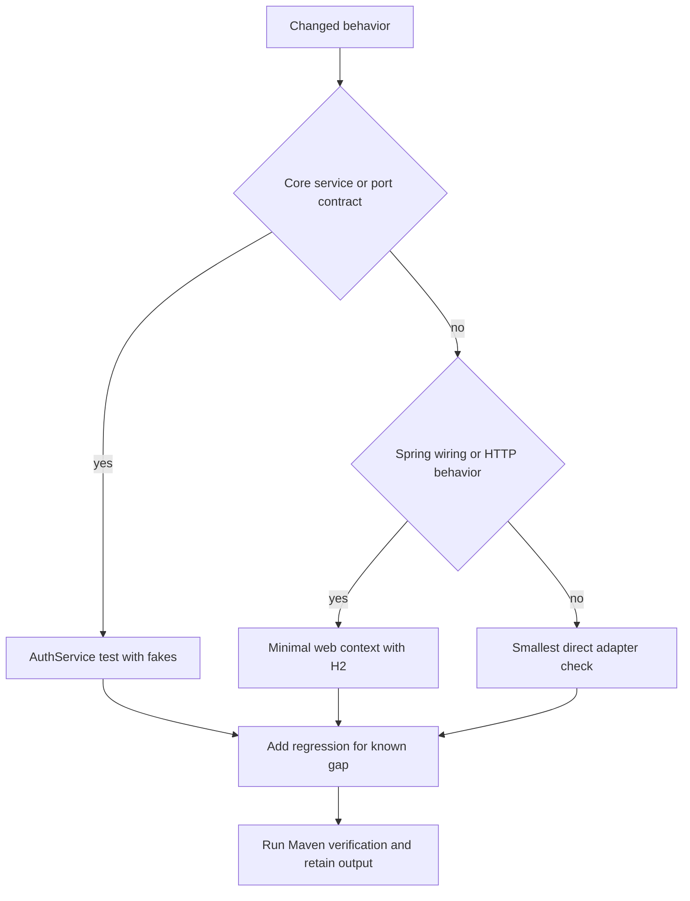

# Validation Strategy and Known Integration Gaps

This repository has **no test sources**: inspection found no `src/test` tree and no `*Test.java` files. The root build is a two-module Maven reactor targeting Java 17 and Spring Boot 3.2.5, and neither module POM declares test dependencies or test plugins. Therefore, `mvn -B verify` is a compilation/package smoke check, **not evidence of automated behavioral coverage**. Preserve the complete Maven output whenever it fails; do not replace it with a summary.

The narrowest useful validation is the one that executes the changed boundary. For a core-only change, use `AuthService` with deterministic fakes. For an adapter, property, or filter-chain change, start a minimal web application with a real H2/JPA context and issue HTTP requests. Do not claim a security behavior is safe merely because the reactor builds.

```bash
mvn -B verify
```

Run the whole reactor when changing shared contracts, dependency versions, or auto-configuration ordering. Otherwise begin with the owning module and escalate only when the changed behavior crosses it:

```bash
mvn -B -pl engine-core verify
mvn -B -pl engine-spring-starter -am verify
```

## Validation layers and decision path



This decision path selects the smallest executable check that crosses the changed boundary, then records a regression before relying on it.

## Baseline startup and conditional wiring

The highest-value integration check is a minimal Spring Boot context using a valid, sufficiently long `engine.security.jwt-secret`, an H2 datasource, and the starter. Assert that the imported auto-configurations load and that exactly the expected port implementations are selected. This catches missing configuration, invalid HMAC key material, JPA discovery failures, and accidental duplicate beans.

Test both branches of each meaningful condition:

| Change area | Narrow executable check | Assertions that matter |
| --- | --- | --- |
| Starter startup | Application-context test with the starter, H2, and valid properties | `AuthService`, `TokenServicePort`, `JwtAuthenticationFilter`, controller, and intended `SecurityFilterChain` can be created. |
| Port replacement | Supply one or a coherent set of application port beans | `@ConditionalOnMissingBean` backs off for that port and `AuthService` receives the supplied implementation. |
| Default selection | Start without replacement ports | In-memory user/refresh/blacklist ports remain selected, while `JwtServiceAdapter` supplies the otherwise-missing `TokenServicePort`. |
| Route configuration | Boot an HTTP test application with default and replacement `public-paths` | `/auth/**` is public by default; replacing the list changes rather than augments the defaults; protected and `/admin/**` routes retain their intended rules. |
| Controller exposure | Enumerate mappings or request them | Only `POST /auth/register`, `POST /auth/refresh`, and `GET /auth/health` are supplied by `AuthController`; `POST /auth/login` and `POST /auth/logout` must remain absent unless an integration adds them. |

Use an isolated application configuration in the test rather than relying on component scanning to find the starter. Test an application-provided security chain as a separate scenario: `SecurityConfig` itself has no missing-chain condition, so chain ordering and coexistence need an explicit assertion.

## Authentication and token regression suite

### Core service contract

At the `AuthService` boundary, use recording fakes for every port and a controllable clock where the adapter permits one. Cover duplicate registration, missing user, password mismatch, and successful registration/login. On success, verify that a hash—not the raw password—is saved and that a refresh record is persisted with the returned token.

Refresh must be tested as an ordered lifecycle, not just as a successful response:

1. A missing record fails before identity lookup.
2. Expired and revoked records fail without issuing replacement tokens.
3. A valid record resolves the user, revokes the old token, then saves a replacement record.
4. Reusing the old token is rejected; its observable message differs if an adapter deletes it versus marks it revoked.
5. Parser/extraction failure and a missing extracted user do not silently rotate the token.

Add a direct compatibility regression that generates a refresh token with the selected `TokenServicePort` and immediately passes it to `extractUserEmail`. This is essential because the normally selected `JwtServiceAdapter` generates a random UUID refresh string, while `AuthService.refresh` asks the same service to parse that string as a signed JWS in order to obtain an email. The refresh endpoint can locate a valid stored UUID record but then fails before revocation and replacement. A security-sensitive change must not mask this defect with a mocked token service.

### HTTP authentication and authorization

Use a protected fixture endpoint and an admin fixture endpoint in a web test. Generate a token with the *actual selected* token service and arrange a user in the repository used by `UserDetailsService`. Verify these outcomes:

| Request case | Expected validation focus |
| --- | --- |
| No `Authorization` header or non-Bearer value | Filter leaves the request anonymous; the protected route reaches the JSON 401 entry point. |
| Valid access JWT and loadable user | Filter populates `SecurityContextHolder`; protected endpoint succeeds. |
| Valid token for a user with `USER` role | Protected endpoint succeeds, `/admin/**` is denied. |
| Valid token for an `ADMIN` user | `/admin/**` succeeds, proving the loaded Spring authorities—not merely the JWT role claim—drive the rule. |
| Blacklisted bearer | Filter does not authenticate it; protected route is unauthorized. |
| Expired, malformed, or wrong-signature bearer | Capture the actual status and body. Current extraction happens before validation and is uncaught, so these inputs can escape as filter exceptions rather than follow the normal 401 path. |
| Valid JWT with unknown email | Capture the actual failure path from `UserDetailsService`; it is not converted by the filter. |

For every negative case, assert status, response content type/body where applicable, and that no authentication remains in the security context. Retain the complete HTTP exchange and server exception output for failures.

### Blacklist and logout boundary

There is no starter HTTP mapping to call `AuthService.logout`, so test it directly unless an application supplies an endpoint. Assert that it sends the original access string to `TokenBlacklistPort`, uses an expiry approximately 900,000 ms after invocation, and writes `LOGOUT_SUCCESS` after blacklisting. Then execute the filter case with that same bearer token.

Test the selected blacklist implementation rather than treating the port as uniform. The default `InMemoryTokenBlacklist` ignores its expiry argument and retains the token until process exit. `TokenBlacklistAdapter` tracks expiry but removes an elapsed entry only when `isBlacklisted` is called. Include an elapsed-expiry check and, for production adapters, cross-instance/durability coverage.

## Source-evidenced gaps requiring regression coverage

The following are current defects or ambiguous integration boundaries, not promised features. Resolve them before security-sensitive releases, and retain a regression that demonstrates the chosen behavior.

1. **Refresh-token format incompatibility — blocking.** `JwtServiceAdapter` issues UUID refresh strings, but both its email extraction and the core refresh flow require a parseable signed JWS. Either issue extractable refresh JWTs, change the core to resolve identity from the stored `userId`, or provide a compatible replacement `TokenServicePort`; test real endpoint rotation and replay after the fix.
2. **Split user-state wiring — blocking for protected requests after default registration.** Default registration writes to `InMemoryUserRepository`, while the supplied `UserDetailsServiceAdapter` is constructed with `JpaUserRepository`. A newly registered default user is not thereby available to bearer authentication. Test register → protected request using the actual chosen repository arrangement, and require it to succeed only after the arrangement is coherent.
3. **Unregistered advertised endpoints — compatibility gap.** The README advertises login and logout, but `AuthController` maps neither. Add mapping-absence regression coverage now; if endpoints are added, cover credentials, bearer extraction, blacklist persistence, and error mapping explicitly.
4. **Potentially permissive alternate security configuration — security risk if activated.** `EngineSecurityFilterAutoConfiguration` is not in the auto-configuration imports, but if an application imports or scans it, its second chain permits `/**` and does not add the JWT filter. Add a context test proving the normal import set excludes it and a separate test for any deliberate import; never enable it without an authorization regression.
5. **Malformed-token status ambiguity.** `JwtAuthenticationFilter` calls `extractUserEmail` before `validateAccessToken` and catches neither parser errors nor unknown-user loading errors. Specify and test a safe status mapping (normally JSON 401 for invalid credentials) before exposing this filter.
6. **Exception mapping is not guaranteed by starter activation.** `GlobalExceptionHandler` maps every `RuntimeException` to 400, but it is not imported by the starter auto-configuration. Test error responses in a minimal consumer context rather than assuming refresh, registration, or parser errors become 400.
7. **Default state and blacklist lifetime are not production-safe.** The effective default state is process-local, and default blacklist entries never expire. Test durable/shared replacements, expiration/cleanup, concurrent registration, and refresh replay semantics before deployment.

## Change checklists

### Auto-configuration, ports, persistence, or properties

- Start the narrowest context with a valid secret and required datasource.
- Assert selected beans by port type, not merely that JPA entities/repositories exist.
- Exercise register → refresh → authenticated request against the selected state stores.
- Test absent, blank, and replacement `public-paths`; ensure the expected public routes have not unintentionally changed.
- Preserve the condition report and full startup failure output when the context does not start.

### Token, filter, authorization, or error-handling changes

- Run valid, missing, blacklisted, expired, malformed, wrong-signature, and unknown-user bearer cases.
- Include `USER` and `ADMIN` authorization assertions for a protected route and `/admin/**`.
- Verify refresh rotation, old-token replay, and the actual token-format round trip.
- Assert exact failure statuses/bodies and no residual authentication state.
- Keep raw request/response and exception output with CI artifacts or the change record.

### Endpoint changes

- Enumerate mappings and test method/path/body shape, including 404 for deliberately absent routes.
- Test unauthenticated access to the endpoint under the configured—not assumed—public path list.
- Where a controller exposes a service exception, add explicit advice/status coverage in the consuming application.

Related context: [authentication domain and ports](/openwiki/concepts/auth-domain-and-ports.md), [Spring Boot starter integration](/openwiki/integrations/spring-boot-starter.md), and [configuration and persistence](/openwiki/operations/configuration-and-persistence.md).
