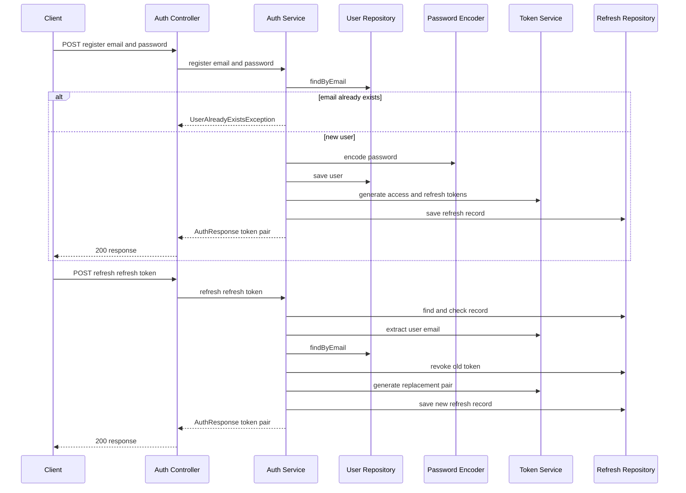

The core `AuthService` owns registration, credential checking, token issuance, refresh rotation, and logout effects through ports. The Spring starter exposes only registration and refresh HTTP routes in `AuthController`; its security filter turns a valid bearer access token into Spring Security authentication for protected routes. This division is important: token syntax and storage are adapter concerns, while the core assumes the selected `TokenServicePort`, refresh repository, blacklist, and audit implementations agree on a single lifecycle.

## Entrypoints and boundaries

| Entry point | Workflow | Current behavior |
| --- | --- | --- |
| `POST /auth/register` | `AuthController.register` → `AuthService.register` | Creates a user and immediately returns an `AuthResponse` containing access and refresh tokens. `/auth/**` is public by default. |
| `POST /auth/refresh` | `AuthController.refresh` → `AuthService.refresh` | Looks up, checks, and rotates a stored refresh token, then returns a new pair—subject to the token-format incompatibility described below. |
| `AuthService.login` | Core API only | Verifies an existing user's password and issues a pair, but no `/auth/login` controller mapping is present. |
| `AuthService.logout` | Core API only | Blacklists the supplied access-token string and records a logout audit event; no `/auth/logout` controller mapping is present. |
| Any request with `Authorization: Bearer ...` | `JwtAuthenticationFilter` | Evaluates blacklist and JWT data before a protected endpoint is authorized. The filter itself also runs for public paths. |

`SecurityConfig` is stateless, disables form login, HTTP Basic, CSRF, and Spring's logout, inserts the JWT filter before `UsernamePasswordAuthenticationFilter`, and requires authentication except for configured public patterns. The defaults include `/auth/**`, root/home, error, actuator, Swagger UI, and API docs; `engine.security.public-paths` replaces that list when nonempty. `/admin/**` additionally needs role `ADMIN`.

## Registration and issuance

`register` first calls `UserRepositoryPort.findByEmail`. A duplicate causes `UserAlreadyExistsException` (a runtime exception); otherwise it BCrypt-encodes the raw password through the configured password port, creates a random string user ID with `Role.USER`, saves the user, and calls the common issuance routine. `login` follows the same routine after loading the email and checking `PasswordEncoderPort.matches`; unknown users and failed matches are runtime failures.

`generateTokens` asks `TokenServicePort` for an access token and refresh token, then persists a domain `RefreshToken` keyed by the refresh-token string. The core record carries user ID, a hard-coded expiry of `Instant.now().plus(7, DAYS)`, and `revoked=false`. Thus token issuance is not complete until the refresh repository accepts the record; the access token is not persisted.


*Caption: Registration creates credentials and a persisted refresh record; the intended refresh path revokes the old record before issuing and storing its replacement.*

### Token implementation contract—and the current break

Both JWT services sign HS256 access tokens using `engine.security.jwt-secret`, set the email as subject, include access-token role, and calculate the access expiry from `engine.security.access-expiration`. `DefaultJwtTokenService` also creates a signed JWT refresh token with its expiry from `engine.security.refresh-expiration`; that format satisfies `AuthService.refresh`, which calls `extractUserEmail(refreshToken)`.

However, the active auto-configured `TokenServicePort` is `JwtServiceAdapter`, and its `generateRefreshToken` returns a random UUID—not a JWT. Its `extractUserEmail` always parses a signed JWT. Consequently, even when the UUID exists in the refresh repository and is neither expired nor revoked, `AuthService.refresh` attempts to parse it as JWT and fails before revoking or replacing it. This is an incompatible implementation, not a failed boolean validation. A safe correction is to make the active adapter generate JWT refresh tokens, or change the refresh service to use the stored record's `userId` and load by ID (with a matching repository capability); do not merely suppress the parse failure.

There is also an expiry consistency requirement: the persisted record always expires after seven days, while JWT refresh expiry is configurable only in `DefaultJwtTokenService`. A JWT refresh implementation must ensure its claim expiry and the repository record's expiry encode the same policy, or refresh acceptance can diverge between the two checks.

## Refresh lifecycle and persistence semantics

The refresh flow is deliberately stateful:

1. `findByToken` must find the exact supplied string; absence raises `RuntimeException("Invalid refresh token")`.
2. `RefreshToken.isExpired()` compares the record expiry to `Instant.now()`, and a revoked or expired record raises `RuntimeException("Refresh token expired or revoked")`.
3. The service extracts an email from the presented token, loads that user, then calls `refreshRepo.revoke(oldToken)` before generating and saving the replacement pair.

The JPA adapter maps the record to `refresh_tokens`, with the token as the primary key and `userId`, `expiry`, and `revoked` columns. Its `revoke` marks an existing entity `true` and saves it. The in-memory default instead removes the token on revoke. Both prevent a subsequent lookup from producing a usable token, but they differ in whether a revoked state remains observable. Neither implementation performs the old-token revoke and new-token save as one explicit transaction in the adapter/service, so a persistence failure after revocation can leave the client without a usable pair. Concurrent refreshes can also both pass the check before either revocation is persisted; rotation needs transactional or atomic consume semantics if one-time use is a security requirement.

## Protected-request authentication

The filter accepts only an `Authorization` header beginning exactly with `Bearer `. Missing or differently formatted headers pass down the chain without an authentication object. A blacklisted token likewise passes through without authentication. For a non-blacklisted bearer value, the filter **extracts the email before** it calls `validateAccessToken`; only a non-null email plus `true` validation loads `UserDetails`, creates a `UsernamePasswordAuthenticationToken` with the stored authorities, and places it in `SecurityContextHolder`.

```mermaid
sequenceDiagram
    participant Client
    participant Filter as JWT Authentication Filter
    participant Blacklist as Token Blacklist
    participant Tokens as Token Service
    participant Details as User Details Service
    participant Context as Security Context
    participant Chain as Security Filter Chain
    Client->>Filter: request with Authorization header
    alt no Bearer header
        Filter->>Chain: continue without authentication
    else bearer token
        Filter->>Blacklist: isBlacklisted token
        alt token is blacklisted
            Filter->>Chain: continue without authentication
        else token not blacklisted
            Filter->>Tokens: extractUserEmail token
            Filter->>Tokens: validateAccessToken token
            alt email present and validation true
                Filter->>Details: loadUserByUsername email
                Filter->>Context: set authentication and authorities
            end
            Filter->>Chain: continue
        end
    end
```
*Caption: The JWT filter only populates the security context after blacklist checking, successful extraction, and successful access-token validation; authorization occurs later in Spring Security's chain.*

### Validation false versus propagated parsing failures

This distinction affects callers and error handling:

- `validateAccessToken` catches every exception from JWT parsing and returns `false`; in the filter that simply means no authentication is installed and the request continues to normal authorization.
- `extractUserEmail` catches nothing. A malformed, expired, wrongly signed, or—in the refresh path—UUID token can throw a JWT runtime exception. The filter calls extraction before validation, so malformed bearer access tokens do **not** reach the `false` branch; they propagate out of the filter. The refresh service has the same behavior when extraction is reached.
- Service-level duplicate-user, unknown-user, credential, refresh lookup, and refresh-state failures are also runtime exceptions. `GlobalExceptionHandler` maps `RuntimeException` raised through controller handling to HTTP 400 with the exception message. It does not turn filter-level extraction failures into a `false` validation result.

A robust redesign should parse once in a boundary that explicitly maps invalid JWT input to unauthenticated behavior (for requests) or a controlled refresh error (for refresh), rather than relying on the later boolean validation.

## Logout and blacklist scope

`logout(accessToken, email)` does not inspect the token: it stores the exact access-token string in `TokenBlacklistPort` until `System.currentTimeMillis() + 900000` (15 minutes) and writes `LOGOUT_SUCCESS` with the supplied email and current timestamp to `AuditLogPort`. The filter checks that blacklist before parsing, which provides immediate denial of a listed bearer token. It neither revokes refresh tokens nor invalidates other access tokens for the user.

The default blacklist is an unsynchronized `HashSet` that ignores the supplied expiry and retains entries indefinitely. `TokenBlacklistAdapter` uses a `ConcurrentHashMap` of token to expiry, removes an entry only when `isBlacklisted` observes it after expiry, and is in-memory as well. Therefore blacklist state is process-local and is lost on restart; clustered deployment needs a shared, expiry-aware blacklist. The 15-minute logout retention must also be at least the maximum accepted access-token lifetime, otherwise a still-valid token can become usable again after blacklist cleanup. Because access expiry is configurable but blacklist expiry is fixed, that invariant is not enforced by configuration.

## Configuration, extension points, and change checklist

`EngineSecurityBeansConfiguration` uses `@ConditionalOnMissingBean` ports so an application can supply its own user, refresh, blacklist, audit, password, or token service. Its default production-facing adapters include JPA refresh storage, BCrypt, `JwtServiceAdapter`, a JPA-backed `UserDetailsService`, and the in-memory `TokenBlacklistAdapter`; `EngineAutoConfiguration` also supplies in-memory fallback ports. Any replacement `TokenServicePort` must satisfy all four methods as a coherent protocol: generated refresh values must be interpretable by `extractUserEmail`, access values must validate with the filter, and the signing key and expiry policy must be shared.

Configure `engine.security.jwt-secret`, `access-expiration`, and `refresh-expiration` before issuing tokens. The HMAC key is derived directly from the secret bytes, so it must meet the JWT library's HS256 key requirements. Treat the secret as deployment secret material and rotate it deliberately: changing it invalidates tokens signed by the old key. Configure `public-paths` carefully because it replaces—not augments—the default allowlist.

Before relying on this workflow, add focused integration tests for: duplicate registration and BCrypt persistence; issued access-token subject/role/expiry; invalid JWT validation returning `false`; malformed bearer extraction propagating from the filter; blacklist denial and expiry behavior; missing/expired/revoked refresh records; one-time and concurrent refresh behavior; and, critically, a round trip through the actually auto-configured `JwtServiceAdapter`. The repository currently contains no Java test sources, so these behaviors are not covered by executable tests in this checkout.

## Related pages

- [Auth domain and ports](../concepts/auth-domain-and-ports.md)
- [Spring Boot starter](../integrations/spring-boot-starter.md)
- [Configuration and persistence](../operations/configuration-and-persistence.md)
- [Validation and known gaps](../testing/validation-and-known-gaps.md)
